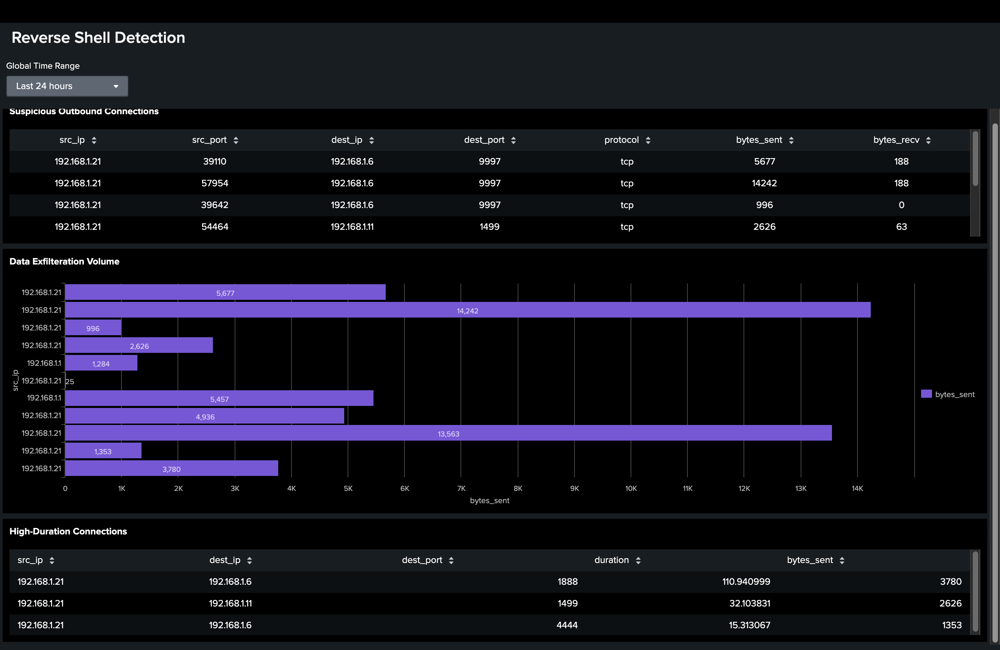

# Reverse Shell Detection Lab - Splunk

**Project Overview**
Detection engineering for post-exploitation attacks. Identifies reverse shell activity through network telemetry analysis using Zeek logs and Splunk SIEM.

**What it detects:**
- Outbound TCP connections to suspicious ports (4444, 5555, 8080, etc.)
- Long-duration connections (C2 beacons)
- High byte transfer volumes (data exfiltration)
- Lateral movement via internal IP ranges

**Attack Chain:**
Port Scan Detection → Brute Force Compromise → **Reverse Shell (This Project)** → Data Exfiltration

**Key Queries:**
- Suspicious outbound ports (NOT IN 80,443,22,53)
- High-risk scoring (bytes_sent, duration, dest_port)
- Behavioral baseline deviation

**Data Source:**
Zeek conn.log → Splunk (Universal Forwarder)

**Dashboard Panels:**
1. Suspicious Outbound Connections (Table)
2. Data Exfiltration Volume (Bar Chart)
3. Risk Scoring (Main Alert Panel)

**Lab Setup:**
- Attacker VM: Kali Linux
- Target VM: Ubuntu Linux
- Listener: Netcat on port 4444
- Capture: tcpdump → Zeek
- Analysis: Splunk Enterprise

**Findings:**
Successfully detected reverse shell activity via non-standard port outbound connections. Payload execution identified through sustained TCP connections with high byte transfers.
